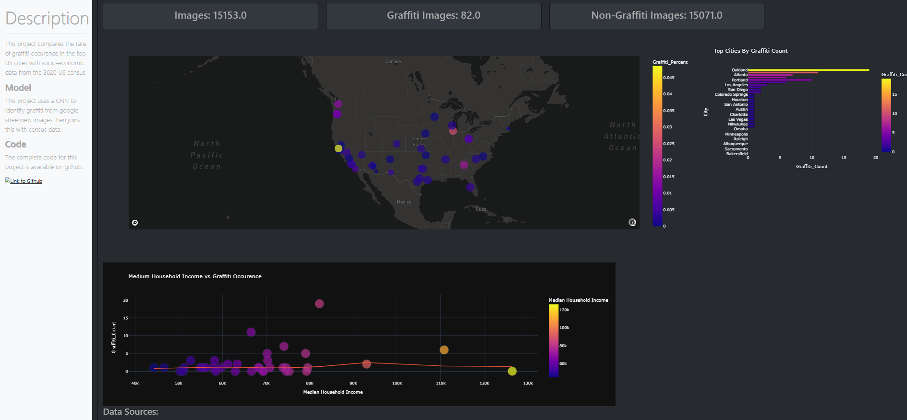

### Overview

This repository contains the code for a front end dashboard that visualizes graffiti occurence and income across the largest cities in the United States.

### Structure

- app.py: main application that contains front end structure and callbacks
- Data-Clean.ipynb: helper script thats ran once to aggregate the raw data files into a format appropriate for visualization

### Sample Output:

The dashboard contains several key components:

- filters for city, state, and household income
- KPI cards displaying number of images containing/not containing graffiti
- Map figure displaying graffiti rate across U.S. cities, selecting a single point will drill down to the image level
- Sorted bar chart by graffiti image count
- Income versus graffiti count scatterplot
  

### Data

Graffiti data was pulled from google streetview and aggregated here: https://www.kaggle.com/datasets/pinstripezebra/graffiti-classification

Income data was from the 2020 U.S. census available here: https://www.census.gov/topics/income-poverty/income/data/tables.html

### Graffiti Identification

Graffiti was identified using a CNN trained using a semi-supervised process incorporating images of known graffiti scraped from google images. More information on the model training process can be found here: https://medium.com/@seelcs12/cnns-for-imbalanced-image-classification-with-tensorflow-7284a8c4a2e4
